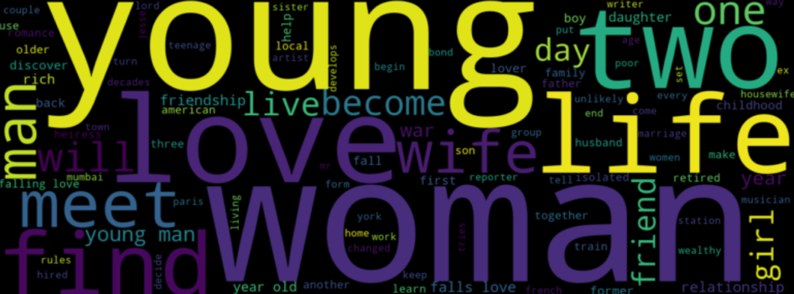

# IMDb Movie Strategy Analysis
Kaggle IMDb CSV 데이터를 기반으로 영화 기획/마케팅 방향성 인사이트를 도출한 분석 프로젝트입니다.

## Goals
1) 타겟팅: 평단 vs 유저 선호 차이
2) 시대 트렌드: 연도별 장르/화제성 변화와 평점 변화
3) 인물 영향: 감독/배우 조합이 흥행/화제성에 미치는 영향

## Dataset (Kaggle CSV)
Used columns: Series_Title, Released_Year, Genre, Runtime, Certificate, IMDB_Rating, Meta_score, No_of_Votes, Gross, Director, Star1~Star4, Overview

## Methods (How)
- 평단 지표: `Meta_score`, 유저 지표: `IMDB_Rating` 기준으로 비교
- 화제성/인지도: `No_of_Votes` 활용
- 흥행: `Gross`(정제 후 숫자화)로 비교
- 트렌드: `Released_Year` 기준으로 기간 구간화 후 장르/지표 변화 분석
- 인물 영향: `Director`, `Star1~Star4` 조합 기준으로 상위 흥행/화제성 그룹 비교

## Key Findings (Summary)
- 타겟팅: 평단/유저 선호 장르가 분리되는 경향 → 목적(흥행 vs 작품성)에 따라 장르/메시지/채널 분리 필요
- 시대 트렌드: 연도별 화제성 장르 비중이 변화 → 트렌드 기반 소재/서사 중심 기획 필요
- 화제성 ≠ 품질: `No_of_Votes`는 인지도 지표일 뿐 평점/흥행 보장 아님 → 품질 지표와 분리해 해석
- 인물 영향: 특정 감독/배우 조합이 유의미하게 나타남(최근 구간에서 더 두드러짐)

## Key Charts

